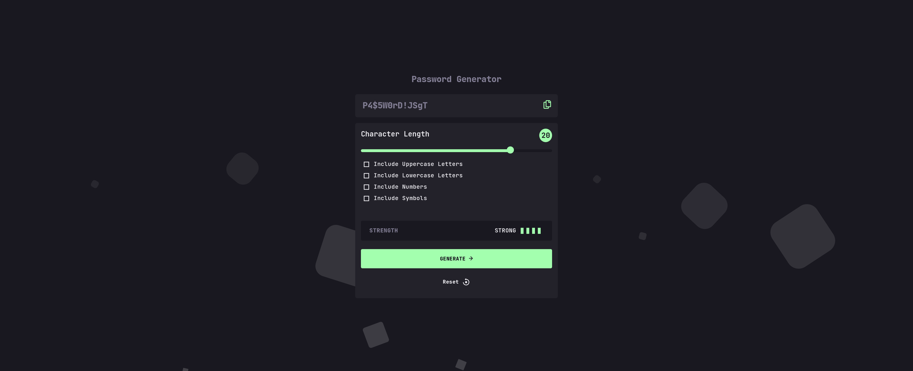
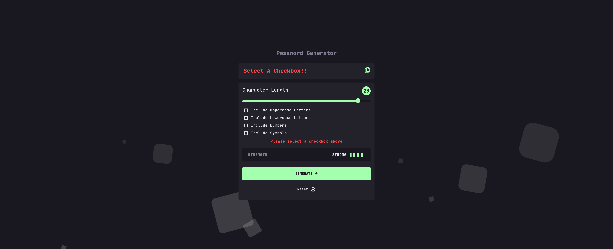

# PassGen - Password Generator App

This is PassGen - A Solid Password Generator App.

- A Password generator that creates random or customized passwords for users. It helps users create stronger passwords that provide greater security for a given type of access.

## Table of contents

- [Overview](#overview)
  - [The challenge](#the-challenge)
  - [Screenshot](#screenshot)
  - [Links](#links)
- [My process](#my-process)
  - [Built with](#built-with)
  - [What I learned](#what-i-learned)
  - [Continued development](#continued-development)
  - [Useful resources](#useful-resources)
- [Author](#author)

## Overview

### The Challenges

Users should be able to:

- Copy the generated password to the computer's clipboard.
- Generate a password based on the selected inclusion options.
- See a strength rating for their generating or generated password.
- See hover and focus states for all interactive elements on the page.
- View the optimal layout for the interface depending on their device's screen size.

### Screenshot




### Links

- Solution URL: [GitHub](https://github.com/SameerJS6/Password-Generator-App.git)
- Live Site URL: [Netlify](https://password-generator-singh.netlify.app/)

## My process

- The first step was very clear as it was studying the given design and the problems that I am about to face.

- Once that was done, started constructing the HTML Code and then dividing the Styling into smaller parts and started styling with the title, display box, and then the main container.

- Styling the whole app took less than 1 day excluding the Slider progress bar and the Checkboxes which took nearly 1.5 - 2 days to style.

- After that, I started with Javascript which was pretty tough For example:- The Checkboxes condition where at least one checkbox should be checked was hard, and then reset button scripting, etc.

- The Javascript part took nearly 1.5 days of mainly googling problems and watching youtube tutorials to implement.
- But all of that was an experience to learn.

### Built with

- Flexbox
- JavaScript
- CSS custom properties
- Mobile-first workflow
- Semantic HTML5 markup

### What I learned

- Where do I start? This challenge was way above my skill level, but the app just looked cool and I couldn't resist trying it out. I thought it would be a great way to practice using JavaScript arrays, and functions but I found the CSS way more challenging!

- For Example:- Styling the Checkboxes and Range or Progress bar was one of the toughest things.

- I learned that not all browsers are created equally! The app looks good on Chrome, Firefox, and Edge now.

- (Sidenote:- Google Chrome is the best browser to develop as it is great in Chrome.)

- Definitely, learned more about Handling the input styles in CSS and Much more Arrays, Especially more Functions in JS.
- Learned a new way to generate random Passwords by using ASCII Char Codes Stored in an Array.

- Styling the slider was a huge headache, especially getting the background behind the thumb a different color than the background ahead of the thumb. This was the code that got it working:

```js
let value;
value = RangeInput.value;

RangeInput.oninput = function () {
  value = RangeInput.value;
  RangeDisplay.innerText = value;
};

SetBackgroundSize(input);

function SetBackgroundSize(input) {
  input.style.setProperty("--background-size", `${GetBackgroundSize(input)}%`);
}

input.addEventListener("input", () => SetBackgroundSize(input));

function GetBackgroundSize(input) {
  const min = +input.min;
  const max = +input.max;
  const value = +input.value;

  const size = ((value - min) / (max - min)) * 100;

  return size;
}
```

- I still not find myself getting comfortable using functions.

- All an over this was a really tough and challenging one for me.

### Continued development

- There's obviously still an insane amount to learn, but I'll keep doing more challenges so I can be presented with a multiple of different problems to try solve.

### Useful resources

- There are just too many to list here. I spent around 1.5 days trying to style that slider. The code above shows how I finally got it to work.
- And Not only that nearly took me 3 days to complete this one.

## Author

- Frontend Mentor - [@SameerJS6](https://www.frontendmentor.io/profile/SameerJS6)
- Github - [@SameerJS6](https://github.com/SameerJS6/)
